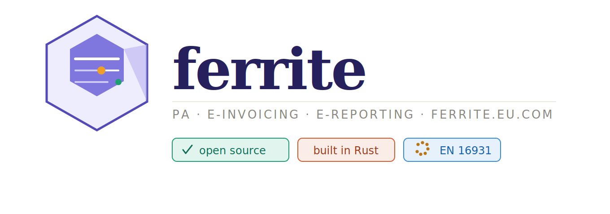
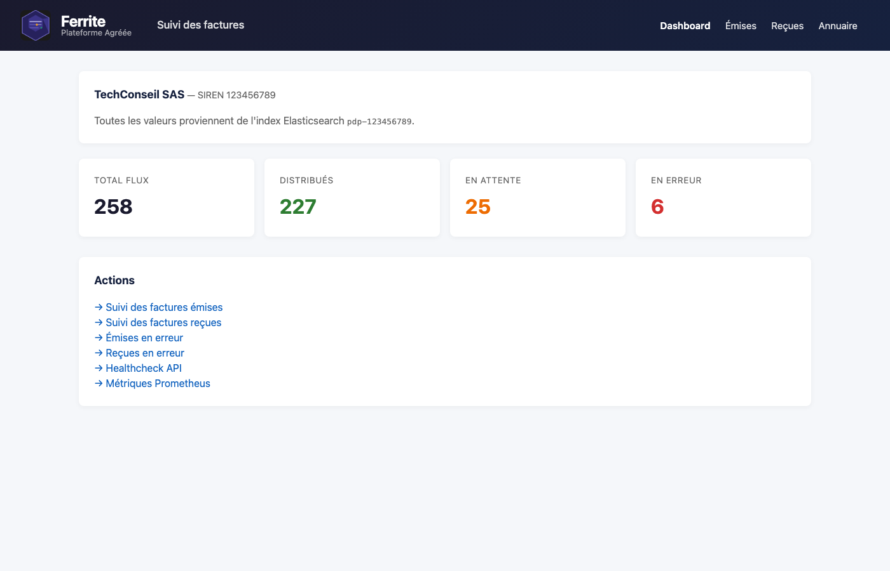
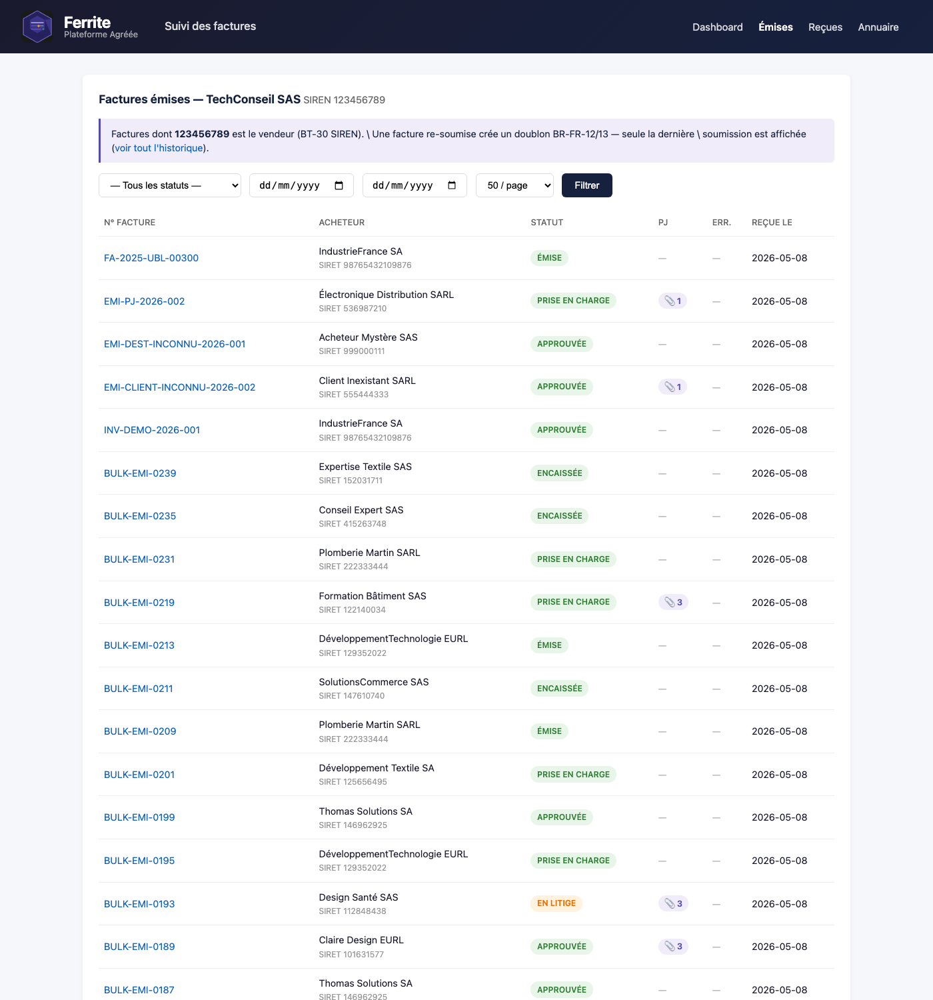
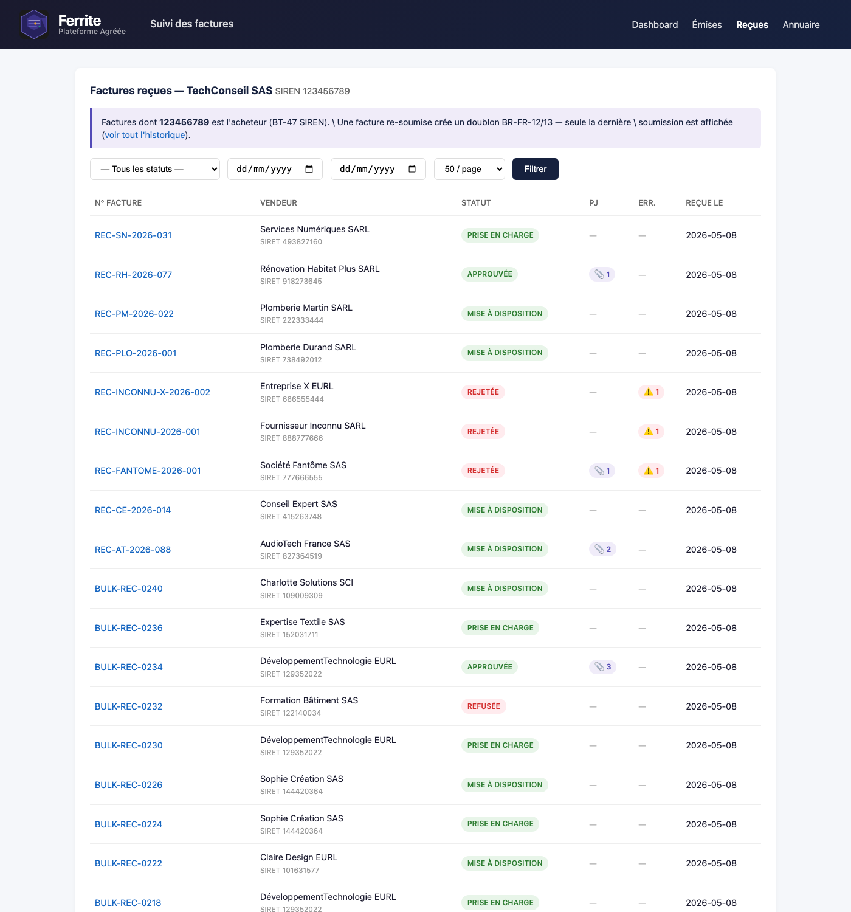
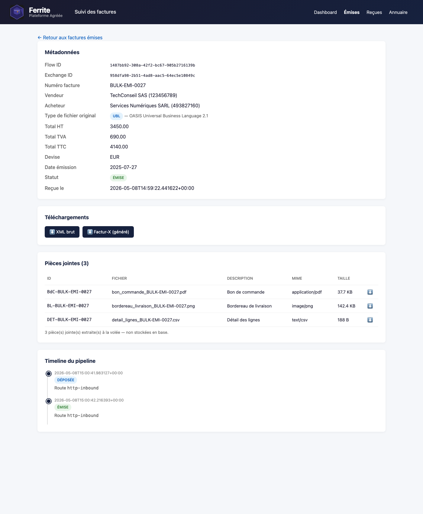
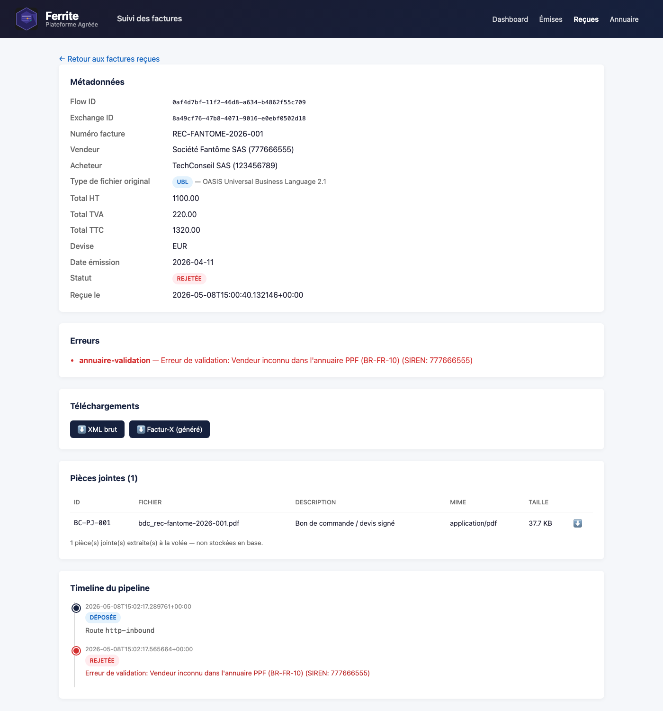
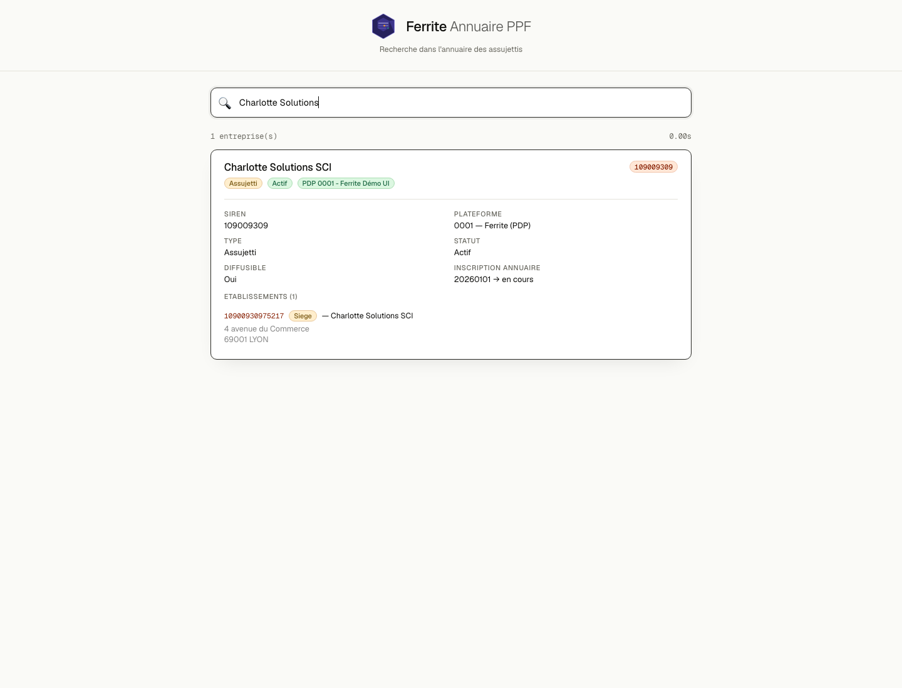
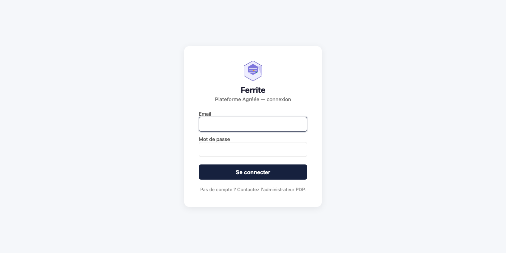

<p align="center">
  <picture>
    <source media="(prefers-color-scheme: dark)" srcset="assets/ferrite_logo_dark.svg">
    <source media="(prefers-color-scheme: light)" srcset="assets/ferrite_logo_light.svg">
    
  </picture>
</p>

# Ferrite — Plateforme de Dématérialisation Partenaire

Librairie modulaire open source en Rust pour la facturation électronique conforme à la réforme française (EN16931, Factur-X, PPF, AFNOR).

## Architecture modulaire

```
┌─────────────────────────────────────────────────────────────────────────┐
│  ┌──────────────┐  ┌──────────────┐  ┌──────────────┐  ┌────────────┐ │
│  │   Parsing    │  │  Validation  │  │Transformation│  │ Génération │ │
│  │  pdp-invoice │  │ pdp-validate │  │pdp-transform │  │  Factur-X  │ │
│  │ UBL/CII/FX  │  │ XSD+Schematron│ │UBL↔CII/Typst│  │  PDF/A-3a  │ │
│  └──────────────┘  └──────────────┘  └──────────────┘  └────────────┘ │
│  ┌──────────────┐  ┌──────────────┐  ┌──────────────┐  ┌────────────┐ │
│  │  CDV (CDAR)  │  │ E-Reporting  │  │   Client     │  │ Serveur    │ │
│  │  pdp-cdar    │  │pdp-ereporting│  │  PPF/AFNOR   │  │  pdp-app   │ │
│  │              │  │              │  │ Batch/Retry  │  │ REST/Auth  │ │
│  └──────────────┘  └──────────────┘  └──────────────┘  └────────────┘ │
│  ┌──────────────┐  ┌──────────────┐  ┌──────────────┐  ┌────────────┐ │
│  │   PEPPOL     │  │    SFTP      │  │ Traçabilité  │  │   Modèle   │ │
│  │ pdp-peppol   │  │  pdp-sftp    │  │  pdp-trace   │  │  pdp-core  │ │
│  │ AS4/Oxalis   │  │              │  │ ES + Dédup   │  │ Pipeline   │ │
│  └──────────────┘  └──────────────┘  └──────────────┘  └────────────┘ │
│  ┌──────────────┐  ┌──────────────┐                                   │
│  │Configuration │  │ Multi-tenant │                                   │
│  │ pdp-config   │  │  Registry    │                                   │
│  │ YAML/Tenant  │  │  par SIREN   │                                   │
│  └──────────────┘  └──────────────┘                                   │
└─────────────────────────────────────────────────────────────────────────┘
```

```
Fichier/Archive ──▶ Réception ──▶ Dédup ──▶ Routage ──▶ Parsing ──▶ Validation ──▶ Flux1 PPF ──▶ Transformation ──▶ Distribution
(SFTP/FS/HTTP/      (pdp-core)  (pdp-trace) (pdp-cdar) (pdp-invoice)(pdp-validate)(pdp-transform)(pdp-transform)   (pdp-peppol)
 PEPPOL/Oxalis)      │            │           │              │           │                │           (pdp-client)
                     ▼            ▼           ▼              ▼           ▼                ▼                │
                 CDAR 501     Doublon?    Facture?       InvoiceData  Rapport XSD  Base/Full_{num} Factur-X PDF    PEPPOL AS4
                 si irrecevable          CDAR? ──▶ CDV   parsée      + Schematron  → SFTP PPF      ou CII/UBL    PPF SFTP tar.gz
                                                                                   (BatchProducer) (RetryProducer)
```

## Crates

| Crate | Rôle | Tests |
|-------|------|-------|
| `pdp-core` | Modèle de données (`InvoiceData` EN16931), pipeline async, erreurs, archives ZIP/tar.gz, `ChannelConsumer`, `RetryProducer`, `DeadLetterProducer`, `TenantTagProcessor` | 91 |
| `pdp-invoice` | **Parsing** : UBL 2.1, CII D22B, Factur-X (PDF), détection auto (facture/CDAR/e-reporting), pièces jointes BG-24, validation BR-FR-12/13 | 125 |
| `pdp-validate` | **Validation** : XSD (libxml2) + Schematron (Saxon) — EN16931, BR-FR, Factur-X | 24 |
| `pdp-transform` | **Transformation** : UBL ↔ CII (XSLT), Factur-X PDF/A-3a, PDF visuel (Typst), Flux 1 PPF (Base + Full), SaxonC FFI | 183 |
| `pdp-cdar` | **CDV** : génération, parsing et routage CDAR D22B, 21 statuts (200→501), `DocumentTypeRouter`, `CdvReturnProcessor` | 96 |
| `pdp-ereporting` | **E-reporting** : flux 10.1/10.2/10.3/10.4 | 88 |
| `pdp-peppol` | **PEPPOL** : SBDH, SMP lookup (MD5), gateway AS4 (Oxalis), envoi/réception inter-PDP | 60 |
| `pdp-annuaire` | **Annuaire PPF** : parser streaming F14 (10 Go en 81s), PostgreSQL, API Directory Service AFNOR, routage 4 mailles | 8 |
| `pdp-client` | **Communication** : PPF SFTP, AFNOR Flow, Annuaire PISTE, `BatchProducer` | 66 |
| `pdp-sftp` | **SFTP** : consumer + producer, auth RSA, vérification known_hosts | 8 |
| `pdp-trace` | **Traçabilité** : Elasticsearch (un index par SIREN), archivage XML+PDF, `DuplicateCheckProcessor` | 6 |
| `pdp-config` | **Configuration** : YAML, multi-tenant (`TenantRegistry`, discovery par SIREN) | 17 |
| `pdp-app` | **Serveur HTTP** : API REST (AFNOR Flow Service), auth Bearer, métriques Prometheus, graceful shutdown | 28 |

**Total : 921 tests** (+ 8 tests ignorés pour génération de fixtures et FOP Java)

## Formats supportés

- **UBL** (Universal Business Language) — XML
- **CII** (Cross-Industry Invoice / UN/CEFACT D22B) — XML
- **Factur-X** — PDF/A-3a avec XML CII embarqué (conforme veraPDF)
- **PDF** — PDF visuel seul (sans XML embarqué)
- **CDV/CDAR** (D22B) — Cycle De Vie
- **E-Reporting** (XSD PPF V1.0) — Flux 10.1/10.2/10.3/10.4

## Matrice de conversion

| Source ↓ / Cible → | CII | UBL | Factur-X | PDF |
|---------------------|-----|-----|----------|-----|
| **UBL**             | ✅ XSLT | — | ✅ XSLT+Typst+lopdf | ✅ Typst |
| **CII**             | — | ✅ XSLT | ✅ Typst+lopdf | ✅ Typst |
| **Factur-X**        | ✅ extraction | ✅ extraction+XSLT | — | ✅ retourne PDF |

Les pièces jointes (BG-24) sont préservées dans toutes les conversions : XML base64, PDF embarqué, extraction Factur-X.

## Interface web

Quatre écrans server-rendered (HTML, sans framework JS, accessibles sans Bearer token) :

### Dashboard `/ui?siren={SIREN}`

KPIs par tenant — total flux, distribués, en attente, en erreur. Le tenant
est identifié comme **vendeur OU acheteur** d'un flux (le même SIREN voit
émissions et réceptions). Sémantique alignée sur les filtres de la liste.

<p align="center"></p>

### Factures émises `/ui/emises?siren={SIREN}` et reçues `/ui/recues?siren={SIREN}`

Deux écrans dédiés (le tenant vendeur ne voit pas les mêmes statuts que le
tenant acheteur). Tableau paginé avec filtres statut (OK / ERREUR /
EN_ATTENTE), plage de dates, et sélecteur de pagination
(25 / 50 / 100 / 200). Les statuts affichés sont les libellés AFNOR
officiels (XP Z12-012 Annexe A V1.2, codes 200-501 : Déposée, Émise,
Reçue, Mise à disposition, Prise en charge, Approuvée, En litige,
Refusée, Encaissée, Rejetée…) — direction-aware (un vendeur ne voit
jamais « Reçue » sur ses propres factures).

<p align="center"></p>
<p align="center"></p>

### Détail facture `/ui/flows/{flowId}?siren={SIREN}`

Métadonnées complètes (vendeur/acheteur + SIREN, **type de fichier
original** badgé — UBL / CII / Factur-X avec nom complet du standard,
totaux HT/TVA/TTC, date d'émission, statut AFNOR), pièces jointes
téléchargeables (extraites à la volée du XML/PDF, jamais stockées en
base), **téléchargements XML brut + Factur-X généré à la volée** (PDF/A-3
avec CII embarqué via Typst pour les sources UBL/CII), et timeline AFNOR
horodatée (seuls les statuts officiels — Déposée, Émise, Reçue —
apparaissent ; les libellés pipeline internes PARSÉ/VALIDÉ/TRANSFORMÉ
sont masqués).

Les pièces jointes affichées sont de **vrais documents avec données
réelles** : bon de commande PDF (template Typst dédié, ≠ rendu de la
facture), bordereau de livraison PNG, détail des lignes CSV — chacun
généré via `pdp tools gen-attachments` à partir des données de la
facture (raison sociale, SIRET, lignes BG-25, montants).

<p align="center"></p>

Sur une facture en erreur, le badge `Rejetée` (CDV 213) remplace le
statut brut, une section "Erreurs" liste les règles violées (ici BR-FR-10,
vendeur absent de l'annuaire PPF) et la timeline est **tronquée à la
première erreur** — les statuts pipeline qui suivent ne reflètent pas
l'issue métier de la facture et ne sont pas affichés :

<p align="center"></p>

### Annuaire PPF `/annuaire`

Recherche unifiée (nom, SIREN, SIRET, adresse) sur les ~500 entreprises
de la copie locale F14. Lien partageable via `?q=...`.

<p align="center"></p>

Voir [docs/ui.md](docs/ui.md) pour l'architecture (trait `TraceBackend`,
mock in-memory pour les tests, sémantique des filtres et des statuts du
pipeline).

### Authentification & isolation tenant

Trois voies d'authentification résolues par un middleware unique
(cf. [crates/pdp-app/src/security.rs](crates/pdp-app/src/security.rs)) :

| Voie | Usage | Routes |
|---|---|---|
| `dev_open: true` | Démo locale, screenshots — accepte tout sans auth | UI + API |
| Cookie `ferrite_session` | Login web `/login` → cookie HMAC signé (HttpOnly, SameSite=Lax) | UI |
| `Authorization: Bearer <tok>` | Clients API (`pdp demo populate`, intégrations) | API |

Chaque token / user porte un `principal`, une liste `allowed_sirens` et un
rôle (`tenant` / `pdp_operator` / `pdp_admin`). L'extractor
`AuthorizedSiren` rejette en 403 toute requête `?siren=X` hors scope du
porteur ; les endpoints API `/v1/stats`, `/v1/flows?status=error`,
`/v1/flows/{id}` exigent un siren et le propagent au store.

**Routes publiques** : `/v1/healthcheck`, `/metrics`, `/login`, `/logout`,
`/annuaire` (recherche annuaire reste accessible sans connexion — choix
produit).

**Outils CLI** :

```bash
# Hash argon2id pour la config (users[].password)
pdp tools hash-password "monMotDePasse"
# → $argon2id$v=19$m=19456,t=2,p=1$...

# Secret aléatoire 32 octets pour http_server.session_secret
pdp tools gen-session-secret
```

**Headers de sécurité** posés sur toutes les réponses : CSP strict
(frame-ancestors none), HSTS 1 an, X-Frame-Options DENY, X-Content-Type-Options
nosniff, Referrer-Policy strict-origin-when-cross-origin.

**Logout server-side** : la signature du cookie est inscrite dans une
revocation list in-memory ; un cookie rejoué après `/logout` est rejeté
jusqu'à expiration naturelle.

Capture d'écran de la page `/login` :

<p align="center"></p>

Voir [docs/ui.md](docs/ui.md#authentification--isolation-tenant) pour le
modèle d'auth complet (table de réponses 401/400/403, exemples YAML
`tokens:` / `users:`, headers de sécurité).

## Démarrage rapide

```bash
# Prérequis macOS
brew install pkgconf saxon qpdf

# Elasticsearch (traçabilité + archivage)
docker run -d --name pdp-es -p 9200:9200 -e "discovery.type=single-node" -e "xpack.security.enabled=false" elasticsearch:8.15.0

# Build
cargo build --release

# Tests
cargo test --workspace    # 836 tests

# Benchmarks
cargo bench --workspace
```

```rust
use pdp_transform::{convert_to, OutputFormat};
use pdp_invoice::ubl::UblParser;

let xml = std::fs::read_to_string("facture.xml").unwrap();
let invoice = UblParser::new().parse(&xml).unwrap();
let result = convert_to(&invoice, OutputFormat::FacturX).unwrap();
std::fs::write("facture.pdf", &result.content).unwrap();
```

## PDP Émettrice / PDP Réceptrice

La PDP opère en deux flux distincts, configurables par route et par ligne de commande :

```
PDP Émettrice                              PDP Réceptrice
─────────────                              ──────────────
Client (fournisseur)                       Autre PDP / Intra-PDP
    │                                          │
    ▼                                          ▼
Validation                                 Validation
    │                                          │
    ▼                                          │ (PAS de Flux 1)
Flux 1 PPF (TOUJOURS)                         │
    │                                          ▼
    ▼                                      CDV 202 "Reçue"
CDV 200 "Déposée"                              │
    │                                          ▼
    ▼                                      Livraison acheteur
Routage (Annuaire PPF)
    ├── PPF → SFTP tar.gz
    ├── PDP distante → AFNOR Flow Service
    └── Même PDP → canal intra-PDP → Pipeline Réception
```

```bash
# Lancer les deux pipelines (défaut)
cargo run -- start

# Émission uniquement
cargo run -- start --mode emitter

# Réception uniquement (serveur HTTP + livraison)
cargo run -- start --mode receiver
```

Les routes dans `config.yaml` peuvent spécifier `pipeline_mode: reception` pour être traitées comme des routes réception.

## Serveur HTTP (API AFNOR Flow Service)

```bash
# Lancer le serveur
cargo run -- start --config config.yaml

# Envoyer une facture via l'API
curl -X POST http://localhost:8080/v1/flows \
  -H "Authorization: Bearer <token>" \
  -F "flowInfo=@flow.json;type=application/json" \
  -F "file=@facture.xml;type=application/xml"

# Consulter les métriques
curl http://localhost:8080/metrics

# Healthcheck
curl http://localhost:8080/health
```

**Endpoints principaux :**
- `POST /v1/flows` — Dépôt de flux (multipart, auth Bearer, codes 202/400/401/413/429)
- `GET /v1/flows/{flowId}` — Détail d'un flux
- `GET /v1/flows?status=error` — Liste des flux en erreur
- `GET /v1/stats` — Statistiques agrégées
- `POST/GET/PATCH/DELETE /v1/webhooks[/{id}]` — Abonnements webhook (AFNOR §5.4)
- `GET /v1/siren/code-insee:{siren}`, `/v1/siret/...`, `/v1/routing-code/...` — Directory Service
- `GET /metrics` — Métriques Prometheus
- `GET /v1/healthcheck` — Healthcheck

**Documentation complète + exemples curl** : [docs/http-api.md](docs/http-api.md)

## Multi-tenancy

Chaque tenant (entreprise) est identifié par son **SIREN** et dispose de son propre répertoire :

```
tenants/
  123456789/              # SIREN
    config.yaml           # Identité, routes, PPF, AFNOR
    sequence.txt          # Compteur séquence PPF (persisté)
    certs/                # Certificats SFTP/TLS (optionnel)
  987654321/
    config.yaml
    sequence.txt
```

**Configuration racine** (`config.yaml`) :
```yaml
tenants_dir: tenants      # Active le mode multi-tenant

# Mapping token Bearer → SIREN (résolution HTTP)
token_tenant_map:
  "token-abc-123": "123456789"
  "token-xyz-789": "987654321"
```

**Sans `tenants_dir`** : la PDP fonctionne en mode mono-tenant (rétrocompatible).

## Documentation

| Document | Contenu |
|----------|---------|
| [docs/http-api.md](docs/http-api.md) | **API HTTP REST** : endpoints AFNOR Flow/Directory + webhooks, exemples curl, codes HTTP, diagrammes séquence, observabilité, multi-tenant, conformité |
| [docs/ui.md](docs/ui.md) | **Interface web** de suivi des factures (Phase 1 — dashboard, liste, détail) |
| [docs/openapi.yaml](docs/openapi.yaml) | Spec OpenAPI 3.1 (importable Swagger UI / codegen) |
| [docs/bruno-collection/](docs/bruno-collection/) | Collection Bruno (testable depuis l'UI ou CLI `bru run`) |
| [docs/api.md](docs/api.md) | API Rust de conversion, exemples par format, pièces jointes BG-24 |
| [docs/webhooks.md](docs/webhooks.md) | Webhooks AFNOR XP Z12-013 §5.4 : événements, sécurité HMAC, retry, OAUTH2 |
| [docs/ereporting.md](docs/ereporting.md) | E-reporting Flux 10.1/10.2/10.3/10.4, BR-FR-MAP, CLI `pdp ereporting` |
| [docs/workflows.md](docs/workflows.md) | **Workflows métier** : 5 cas d'usage AFNOR XP Z12-014 (émission, rejet, réception, intra-PDP, relais 210/212) avec diagrammes Mermaid |
| [docs/performance.md](docs/performance.md) | Benchmarks Criterion (parsing, validation, transformation, pipeline) |
| [docs/facturx.md](docs/facturx.md) | Pipeline Factur-X PDF/A-3a, validation |
| [docs/tracabilite.md](docs/tracabilite.md) | Traçabilité Elasticsearch : architecture, index par SIREN, API |
| [docs/installation.md](docs/installation.md) | Prérequis, Elasticsearch, build, CLI, configuration |
| [docs/tests.md](docs/tests.md) | Tests par crate, benchmarks, fixtures, veraPDF |
| [docs/docker.md](docs/docker.md) | Docker/Podman, docker-compose |
| [docs/archives.md](docs/archives.md) | Archives ZIP/tar.gz : décompression auto à l'entrée, builders |
| [docs/cdar.md](docs/cdar.md) | CDV/CDAR D22B : routage entrant, sources (client/PDP/PPF), statuts 200→212 |
| [docs/peppol.md](docs/peppol.md) | PEPPOL AS4 : architecture 4 coins, SBDH, SMP, envoi/réception inter-PDP |
| [docs/flux1.md](docs/flux1.md) | Flux 1 PPF : XSLT CII/UBL → Base/Full, détection auto, différences Base vs Full, nommage SFTP |
| [docs/ppf-afnor.md](docs/ppf-afnor.md) | Communication PPF SFTP, annuaire PISTE, AFNOR |
| [docs/specifications.md](docs/specifications.md) | Spécifications techniques complètes (architecture, pipeline, formats, sécurité) |
| [docs/todo.md](docs/todo.md) | Roadmap : Typst, EndpointID, SFTP PPF, BR-FR, e-reporting, annuaire |

## Spécifications de référence

Toutes les spécifications sont dans le répertoire [`specs/`](specs/).

### Normes AFNOR

| Document | Description |
|----------|-------------|
| [XP Z12-012](specs/afnor/XP_Z12-012_Socle_technique.pdf) | Socle technique — formats, profils, règles de validation |
| [XP Z12-013](specs/afnor/XP_Z12-013_Interoperabilite.pdf) | Interopérabilité — échanges inter-PDP, API Flow/Directory |
| [XP Z12-014](specs/afnor/XP_Z12-014_Cas_usage.pdf) | Cas d'usage B2B — scénarios métier |

### Cas d'usage (XP Z12-014 Annexe A V1.3)

| Document | Description |
|----------|-------------|
| [Annexe A FR (PDF)](specs/use-cases/XP_Z12-014_Annexe_A_V1.3_FR.pdf) | 42 cas d'usage — version française |
| [Annexe A EN (PDF)](specs/use-cases/XP_Z12-014_Annexe_A_V1.3_EN.pdf) | 42 use cases — English version |
| [Annexe A FR (Markdown)](specs/use-cases/XP_Z12-014_Annexe_A_V1.3_FR.md) | Version texte exploitable |
| [Annexe A EN (Markdown)](specs/use-cases/XP_Z12-014_Annexe_A_V1.3_EN.md) | Searchable text version |
| [Exigences conformité](specs/use-cases/XP_Z12_Exigences_conformite.pdf) | Exigences et conformité XP Z12 |

### API Swagger (XP Z12-013)

| Document | Description |
|----------|-------------|
| [Flow Service V1.2.0](specs/swagger/ANNEXE_A_XP_Z12-013_Flow_Service_V1.2.0.json) | API d'échange de flux entre PDP |
| [Directory Service V1.2.0](specs/swagger/ANNEXE_B_XP_Z12-013_Directory_Service_V1.2.0.json) | API annuaire / découverte |

### PPF / Chorus Pro

| Document | Description |
|----------|-------------|
| [DSE Chorus Pro](specs/ppf/DSE_Chorus_Pro.pdf) | Dossier de spécifications externes Chorus Pro |
| [DSE Document général](specs/ppf/DSE_Document_general.pdf) | Spécifications externes — document général |

### Code lists et matrices

| Document | Description |
|----------|-------------|
| [EN16931 Codelists v16](specs/en16931-codelists-v16-fx1.08.xlsx) | Code lists EN16931 / Factur-X 1.08 |
| [Formats & profils Z12-012](specs/codelists/XP_Z12-012_Formats_profils_reference.xlsx) | Document maître formats et profils |
| [Règles métier EN16931](specs/codelists/Regles_metier_EN16931.xlsx) | Règles métier et code lists |
| [Statuts facture G2B/B2G](specs/codelists/Statuts_facture_G2B_B2G.xlsx) | Codes statuts facture |
| [Statuts CDV mapping](specs/codelists/Statuts_CDV_mapping.xlsx) | Mapping statuts cycle de vie |
| [Flux F1 UBL/CII](specs/codelists/Flux_F1_UBL_CII.xlsx) | Flux 1 — formats UBL et CII |
| [Flux F13/F14](specs/codelists/Flux_F13_F14.xlsx) | Configuration flux F13 et F14 |
| [E-Reporting correspondance](specs/codelists/E-Reporting_flux_correspondance.xlsx) | Correspondance flux e-reporting |

### Autres

| Document | Description |
|----------|-------------|
| [UN/CEFACT BRS](specs/uncefact/UNCEFACT_BRS_Update.pdf) | Business Requirements Specification Update |
| [Factur-X XMP schema](specs/facturx-extension-schema.xmp.txt) | Extension XMP pour Factur-X PDF/A-3 |

## Licence

Apache-2.0
