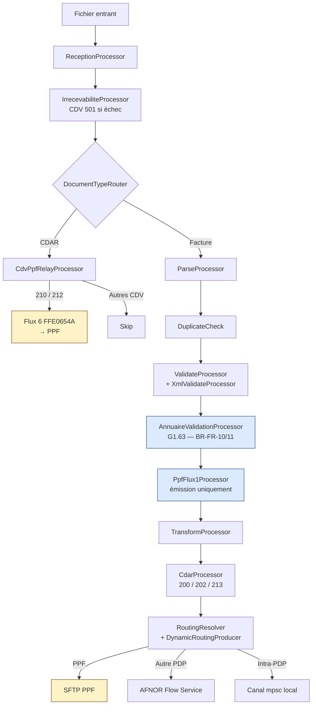
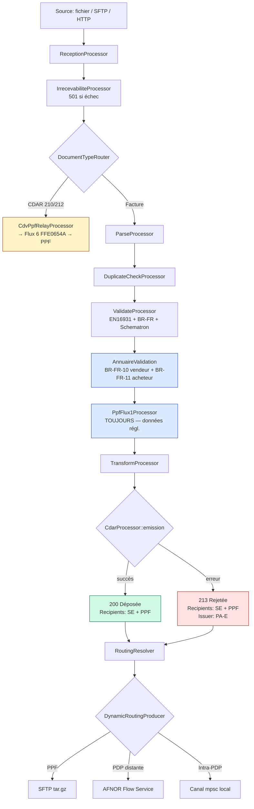
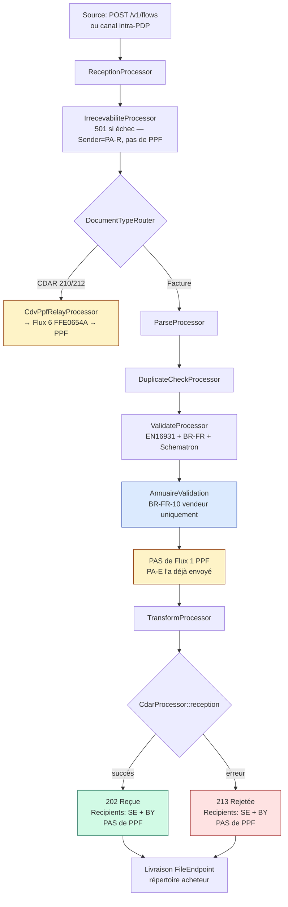

# CDV / CDAR — Comptes-rendus De Vie

Module `pdp-cdar` : génération, parsing et routage des statuts de cycle de vie des factures,
conforme au format UN/CEFACT CrossDomainAcknowledgementAndResponse (CDAR) D23B.

## Architecture



## Processors

### `DocumentTypeRouter`

Détecte le type de document entrant (facture, CDAR, e-reporting) et positionne
le header `document.type` sur l'exchange. Si c'est un CDAR, il est immédiatement
parsé et les propriétés `cdv.*` sont renseignées.

Les processors suivants (`ParseProcessor`, `ValidateProcessor`, `TransformProcessor`)
skipperont automatiquement si `document.type = "CDAR"`.

### `CdvPpfRelayProcessor`

Relaye certains CDV reçus vers le PPF via le Flux 6 (code interface FFE0654A).
Placé juste après `DocumentTypeRouter` dans les processors communs.

D'après l'onglet "Acteurs CDV" (XP Z12-012 Annexe A V1.2), seuls les CDV
suivants doivent être transmis au PPF :

| CDV | Statut | Relayé au PPF ? |
|-----|--------|-----------------|
| **210** | Refusée | **OUI** — via Flux 6 FFE0654A |
| **212** | Encaissée | **OUI** — via Flux 6 FFE0654A |
| 200 | Déposée | Géré par le pipeline (Flux 1, pas le relay) |
| 213 | Rejetée | Géré par le pipeline (CdarProcessor) |
| 204, 205, 206, 207, 208, 209, 211, 214, 220 | Autres | **NON** — pas relayés au PPF |
| 501 | Irrecevable | **NON** — envoyé à PA-E uniquement |

Le relay est non-bloquant : si l'envoi au PPF échoue, le pipeline continue.

### `CdarProcessor`

Génère un CDV après traitement d'une facture. Paramétré par `CdarMode` :

- **`CdarProcessor::emission()`** (PDP émettrice) :
  - **200 Déposée** si la facture est valide (Recipients: SE + PPF)
  - **213 Rejetée** si erreurs (Recipients: SE + PPF, Issuer: PA-E)
- **`CdarProcessor::reception()`** (PDP réceptrice) :
  - **202 Reçue** si la facture est valide (Recipients: SE + BY, pas de PPF)
  - **213 Rejetée** si erreurs (Recipients: SE + BY, pas de PPF)

### `IrrecevabiliteProcessor`

Génère un CDAR 501 (Irrecevable) si les contrôles de réception échouent.
Sender = PA-R, Issuer = PA-R, Recipients = PA-E (pas de PPF).

### `CdvReceptionProcessor`

Parse un CDV entrant et met à jour le statut de l'exchange.

### `CdvReturnProcessor`

Renvoie le CDV généré par le pipeline vers l'émetteur de la facture.

## Sources de CDAR entrants

Les CDAR peuvent arriver de 4 sources différentes, identifiées par la
propriété `cdv.source` :

| Source | Valeur `cdv.source` | Comment |
|--------|-------------------|---------|
| **Client (émission)** | `client` | Le vendeur nous envoie un statut (ex: 212 Encaissée) |
| **Client (réception)** | `client` | L'acheteur nous envoie un statut (ex: 204 Prise en charge, 210 Refusée) |
| **Autre PDP (PEPPOL)** | `peppol` | CDV reçu via AS4 (header `source.protocol` = `peppol-as4`) |
| **Autre PDP (AFNOR)** | `afnor` | CDV reçu via Flow Service (header `source.protocol` = `afnor-flow`) |
| **PPF** | `ppf` | CDV reçu du PPF (nom de fichier `FFE06*` ou `CFE*`) |

## Propriétés de l'exchange après routage CDAR

| Propriété | Description |
|-----------|-------------|
| `cdv.received` | `"true"` si un CDV a été parsé |
| `cdv.document_id` | Identifiant du CDV |
| `cdv.type_code` | `"305"` (transmission) ou `"23"` (traitement) |
| `cdv.status_code` | Code statut (200, 201, 202, 204, 205, 207, 210, 212, 213…) |
| `cdv.invoice_id` | Numéro de la facture référencée |
| `cdv.process_condition` | Condition de traitement |
| `cdv.guideline_id` | Guideline ID du CDV |
| `cdv.source` | Source du CDAR (`client`, `peppol`, `afnor`, `ppf`) |
| `cdv.sender.id` | Identifiant de l'émetteur du CDV |
| `cdv.recipient.N.id` | Identifiant du destinataire N |

## Statuts de cycle de vie

### Phase Transmission (TypeCode 305)

| Code | Statut | FlowStatus |
|------|--------|------------|
| 200 | Déposée | Distributed |
| 201 | Émise | Distributed |
| 202 | Reçue | Acknowledged |
| 203 | Mise à disposition | Distributed |
| 213 | Rejetée | Rejected |
| 221 | Erreur de routage | Error |
| 300 | Transmise PPF | Distributed |
| 301 | Transmise PDP | Distributed |
| 400 | Transmise destinataire | Distributed |
| 501 | Irrecevable | Rejected |

### Phase Traitement (TypeCode 23)

| Code | Statut | FlowStatus |
|------|--------|------------|
| 204 | Prise en charge | Acknowledged |
| 205 | Approuvée | Acknowledged |
| 206 | Approuvée partiellement | Acknowledged |
| 207 | En litige | WaitingAck |
| 208 | Suspendue | WaitingAck |
| 209 | Service fait | Acknowledged |
| 210 | Refusée | Rejected |
| 211 | Paiement transmis | Acknowledged |
| 212 | Encaissée | Acknowledged |
| 214 | Visée | Acknowledged |
| 220 | Annulée | Cancelled |

## Acteurs CDV (qui émet quoi)

Référence : XP Z12-012 Annexe A V1.2, onglet "Acteurs CDV".

PA-E = PDP émettrice, PA-R = PDP réceptrice, WK = Plateforme,
C1 = Émetteur (vendeur), C4 = Destinataire (acheteur).

### Statuts émis par la PDP

| Code | Statut | Émetteur | Issuer | Sender | Recipients | PPF ? |
|------|--------|----------|--------|--------|------------|-------|
| 200 | Déposée | PA-E | WK | WK | SE + PPF | **OUI** |
| 201 | Émise | PA-E | WK | WK | SE | NON |
| 202 | Reçue | PA-R | WK | WK | SE + BY | NON |
| 203 | Mise à disposition | PA-R | WK | WK | SE + BY | NON |
| 213 | Rejetée (réception) | PA-R | WK | WK | SE + BY | NON |
| 213 | Rejetée (émission) | PA-E | PA-E | WK | SE + PPF | **OUI** |
| 221 | Erreur routage | PA-R | PA-R | PA-R | PA-E | NON |
| 501 | Irrecevable | PA-R | PA-R | PA-R | PA-E | NON |

### Statuts émis par l'acheteur/vendeur (relayés par la PDP)

| Code | Statut | Émetteur | Issuer | Recipients | PPF ? | Relais Flux 6 |
|------|--------|----------|--------|------------|-------|---------------|
| 204 | Prise en charge | Acheteur | Acheteur | Vendeur | NON | — |
| 205 | Approuvée | Acheteur | Acheteur | Vendeur | NON | — |
| 206 | Approuvée partiellement | Acheteur | Acheteur | Vendeur | NON | — |
| 207 | En litige | Acheteur | Acheteur | Vendeur | NON | — |
| 208 | Suspendue | Acheteur | Acheteur | Vendeur | NON | — |
| 209 | Complétée | Vendeur | Vendeur | Acheteur | NON | — |
| **210** | **Refusée** | Acheteur | Acheteur | Vendeur | **OUI** | **FFE0654A** |
| 211 | Paiement transmis | Acheteur | Acheteur | Vendeur | NON | — |
| **212** | **Encaissée** | Vendeur | Vendeur | Acheteur | **OUI** | **FFE0654A** |
| 214 | Visée | Agent | Agent | Vendeur + Acheteur | NON | — |
| 220 | Annulée | Vendeur | Vendeur | Acheteur | NON | — |

## Codes motifs CDV

Référence : XP Z12-012 Annexe A V1.2, onglet "Tableau des motifs de STATUTS".

Les codes motifs ont des applicabilités différentes selon le contexte (émission,
réception, PPF). Un code applicable en "REJETÉE Émission" n'est pas forcément
applicable en "REJETÉE Réception" ou en "REFUSÉE".

### Codes IRR — Irrecevabilité (CDV 501)

Utilisés par `IrrecevabiliteProcessor` quand les contrôles de réception échouent.
Applicables en émission ET en réception (même contrôles dans les deux pipelines).

| Code | Libellé | Mapping | Implémenté |
|------|---------|---------|------------|
| `IRR_VIDE_F` | Fichier du flux vide | REC-01 | oui |
| `IRR_TYPE_F` | Type/extension du fichier invalide | REC-02 | oui |
| `IRR_SYNTAX` | Fichier syntaxiquement invalide | Fallback | oui |
| `IRR_TAILLE_F` | Fichier > 100 Mo | BR-FR-19 | oui |
| `IRR_NOM_PJ` | Nom de fichier invalide (caractères, absent) | REC-03/04 | oui |
| `IRR_TAILLE_PJ` | Pièce jointe trop volumineuse | — | non |
| `IRR_VID_PJ` | Pièce jointe vide | — | non |
| `IRR_EXT_DOC` | Extension de pièce jointe invalide | — | non |
| `IRR_ANTIVIRUS` | Fichier infecté | — | non |

### Codes REJ — Rejet technique (CDV 213)

Contrôles automatiques effectués par la PDP (pas par l'acheteur).
Applicables en **REJETÉE Émission** ET **REJETÉE Réception**.
Provenance : contrôles PDP (pas B2G).

| Code | Libellé | Pattern `classify_error_reason()` | Émission | Réception |
|------|---------|-----------------------------------|----------|-----------|
| `REJ_SEMAN` | Erreur sémantique | "syntax", "xml", "parse", "schematron", "br-", step "validate" | X | X |
| `REJ_UNI` | Contrôle unicité | "xsd", "schema" | X | X |
| `REJ_COH` | Cohérence de données | (dans l'enum) | X | X |
| `REJ_ADR` | Contrôle d'adressage | (dans l'enum) | X | X |
| `REJ_CONT_B2G` | Contrôles métier B2G | (dans l'enum) | X | X |
| `REJ_REF_PJ` | Référence de PJ | (dans l'enum) | X | X |
| `REJ_ASS_PJ` | Association de la PJ | (dans l'enum) | X | X |

### Codes applicables en REJETÉE Émission + Réception + REFUSÉE

Ces codes peuvent être générés par la PDP (rejet) ou par l'acheteur (refus).

| Code | Libellé | Pattern | Rej. Émi | Rej. Réc | Refusée |
|------|---------|---------|----------|----------|---------|
| `DOUBLON` | Facture en doublon | "doublon", "duplicate" | X | X | X |
| `MONTANTTOTAL_ERR` | Montant total erroné | "montant", "total", "amount" | X | X | X |
| `CALCUL_ERR` | Erreur de calcul | "calcul", "calculation" | X | X | X |
| `ADR_ERR` | Adresse de facturation erronée | "adresse", "address" | X | X | X |

### Codes applicables uniquement en REJETÉE Émission

| Code | Libellé | Pattern | Commentaire |
|------|---------|---------|-------------|
| `DEST_INC` | Destinataire inconnu | (dans l'enum) | Annuaire PPF : SIREN introuvable |

### Codes métier — Refusée / En litige (CDV 210, 207, 206, 208)

Utilisés par l'**acheteur** dans les CDV de phase Traitement (TypeCode 23).
La PDP les reçoit mais ne les génère pas elle-même.
Provenance : B2G (acheteur public) ou IMR/CDAR (intermédiaire).

| Code | Libellé | Refusée | En litige | Approv. part. | Suspendue |
|------|---------|---------|-----------|---------------|-----------|
| `TX_TVA_ERR` | Taux de TVA erroné | X | | | |
| `NON_CONFORME` | Mention légale manquante | X | X | | |
| `DEST_ERR` | Erreur de destinataire | X | X | | |
| `TRANSAC_INC` | Transaction inconnue | X | X | | |
| `EMMET_INC` | Émetteur inconnu | X | X | | |
| `CONTRAT_TERM` | Contrat terminé | X | X | | |
| `DOUBLE_FACT` | Double facture | X | X | | |
| `CMD_ERR` | Commande incorrecte | X | X | X | X |
| `COORD_BANC_ERR` | Coordonnées bancaires | X | | X | |
| `SIRET_ERR` | SIRET erroné | | X | X | X |
| `CODE_ROUTAGE_ERR` | Code routage erroné | | X | X | X |
| `REF_CT_ABSENT` | Référence contractuelle absente | X | X | X | X |
| `REF_ERR` | Référence incorrecte | | X | X | X |
| `PU_ERR` | Prix unitaires incorrects | | X | X | |
| `REM_ERR` | Remise erronée | | X | X | |
| `QTE_ERR` | Quantité incorrecte | | X | X | |
| `ART_ERR` | Article incorrect | | X | X | |
| `MODPAI_ERR` | Modalités paiement incorrectes | | X | X | |
| `QUALITE_ERR` | Qualité incorrecte | | X | X | |
| `LIVR_INCOMP` | Problème de livraison | | X | X | |
| `JUSTIF_ABS` | Justificatif absent | | | | X |
| `AUTRE` | Autre motif | X | X | | |

### Codes spéciaux

| Code | Libellé | Statut applicable | Commentaire |
|------|---------|-------------------|-------------|
| `NON_TRANSMISE` | Destinataire non connecté | DÉPOSÉE (200) | Statut spécial : facture déposée mais pas transmissible |
| `ROUTAGE_ERR` | Erreur de routage | ERREUR_ROUTAGE (221) | Erreur technique de routage |

## Pipelines émission et réception

### Pipeline Émission (PDP émettrice — PA-E)



### Pipeline Réception (PDP réceptrice — PA-R)



### Séquence complète émission → réception → retours CDV

```mermaid
sequenceDiagram
    participant V as Vendeur (C1)
    participant PAE as PA-E (PDP émettrice)
    participant PPF as PPF
    participant PAR as PA-R (PDP réceptrice)
    participant A as Acheteur (C4)

    V->>PAE: Facture
    PAE->>PAE: Validation + Annuaire (G1.63)
    PAE->>PPF: Flux 1 (données régl.)
    PAE-->>V: CDV 200 Déposée (SE + PPF)
    PAE->>PAR: AFNOR Flow Service
    PAR-->>V: CDV 202 Reçue (SE + BY, sans PPF)
    PAR->>A: Livraison facture

    Note over A: L'acheteur traite la facture

    A->>PAR: CDV 210 Refusée (ou 205, 207, 208…)
    PAR->>PAE: Transmission CDV
    PAE->>PPF: Flux 6 FFE0654A (si 210/212)
    PAE-->>V: Transmission CDV à l'émetteur

    Note over V: Le vendeur encaisse la facture

    V->>PAE: CDV 212 Encaissée
    PAE->>PPF: Flux 6 FFE0654A
    PAE->>PAR: Transmission CDV
    PAR-->>A: Transmission CDV à l'acheteur
```

### Résumé : qui envoie quoi au PPF ?

| Flux | Contenu | Code interface | Émetteur | Quand |
|------|---------|----------------|----------|-------|
| **Flux 1** | Données réglementaires facture | FFE0111A (UBL) / FFE0112A (CII) | PA-E | À chaque facture émise |
| **Flux 6** | CDV 210 Refusée | FFE0654A | PA-E | Quand l'acheteur refuse |
| **Flux 6** | CDV 212 Encaissée | FFE0654A | PA-E | Quand le vendeur encaisse |
| **CDV 200** | Statut Déposée | (dans le CDV XML) | PA-E | PPF comme recipient XML |
| **CDV 213** | Statut Rejetée (émission) | (dans le CDV XML) | PA-E | PPF comme recipient XML |

**PA-R (réception) n'envoie JAMAIS au PPF** — ni Flux 1, ni Flux 6, ni CDV.

### Ordre des contrôles et codes d'erreur

| Étape | Contrôle | Code erreur | CDV |
|-------|----------|-------------|-----|
| 1. Réception | Fichier vide | IRR_VIDE_F | 501 |
| 1. Réception | Extension invalide | IRR_TYPE_F | 501 |
| 1. Réception | Fichier > 100 Mo | IRR_TAILLE_F | 501 |
| 1. Réception | Nom fichier invalide | IRR_NOM_PJ | 501 |
| 2. Irrecevabilité | XML non parseable | IRR_SYNTAX | 501 |
| 5. Doublons | Facture en doublon | DOUBLON | 213 |
| 6. Validation | Erreur sémantique | REJ_SEMAN | 213 |
| 6. Validation | Erreur XSD | REJ_UNI | 213 |
| 6. Validation | Montant erroné | MONTANTTOTAL_ERR | 213 |
| 6. Validation | Erreur de calcul | CALCUL_ERR | 213 |
| 6. Validation | Adresse erronée | ADR_ERR | 213 |
| 7. Annuaire | Vendeur absent (BR-FR-10) | REJ_COH | 213 |
| 7. Annuaire | Acheteur absent (BR-FR-11) | DEST_INC | 213 |

## Tests

170+ tests couvrant :

- **model** (12) : statuts, rôles, codes action, parties, sérialisation
- **generator** (15) : génération XML pour tous les statuts (200, 202, 213 émi/réc, 501)
- **parser** (18) : parsing XML, fixtures officielles UC1-UC4
- **processor** (112) : CdarProcessor (émission/réception), CdvReceptionProcessor,
  IrrecevabiliteProcessor, DocumentTypeRouter, classify_error_reason (17 tests),
  map_reception_to_irrecevabilite, EMMET_INC/DEST_INC/REJ_COH
- **ppf_relay** (10) : CdvPpfRelayProcessor — relay 210/212, skip 200/204/205/207,
  skip sans CDV, erreur PPF non-bloquante, should_relay exhaustif (tous les codes)
- **pipeline_error_tests** (23) : tests d'intégration pipeline complet avec fichiers
  invalides en mode émission et réception, vérification codes motifs et messages
- **lifecycle_integration** (28) : CDV 200/202/213/501, émission vs réception,
  conformité AFNOR (recipients SE/BY/PPF, issuer PA-E/PA-R, Sender)
