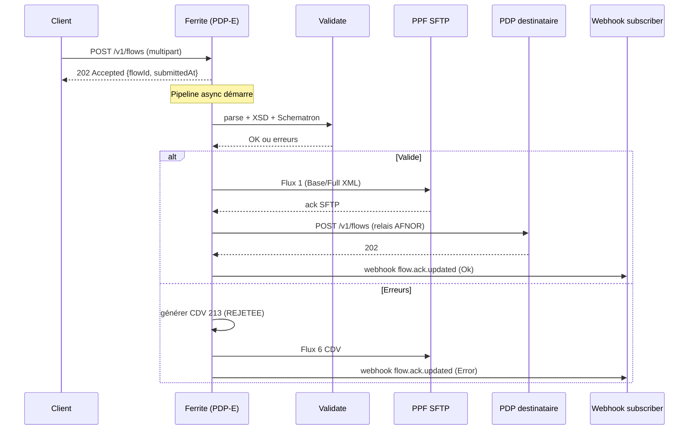
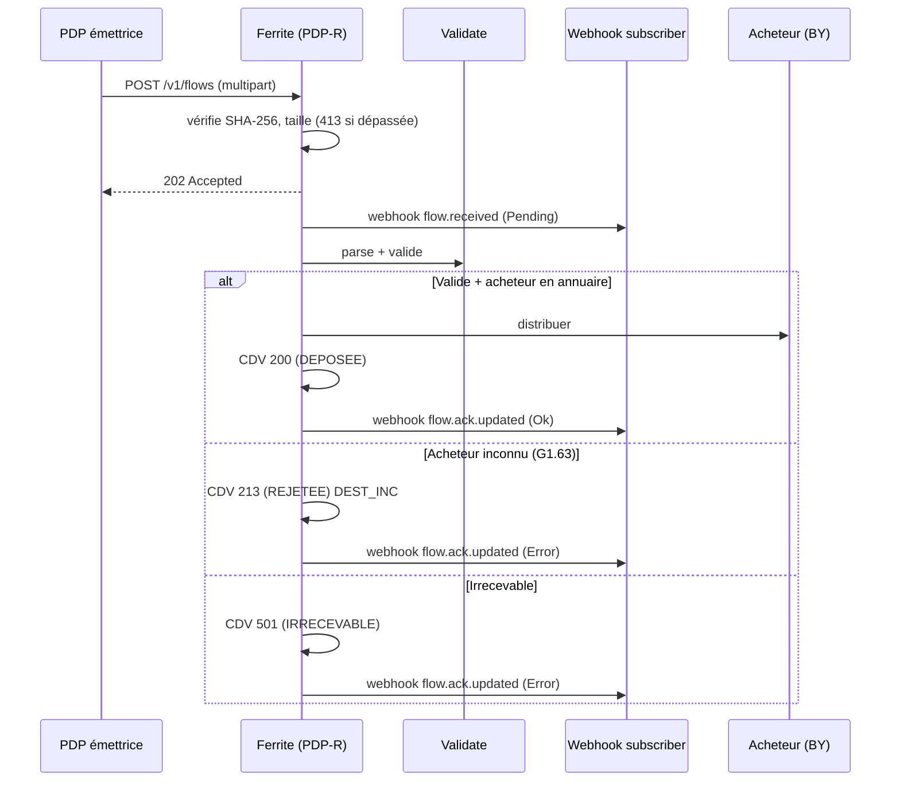
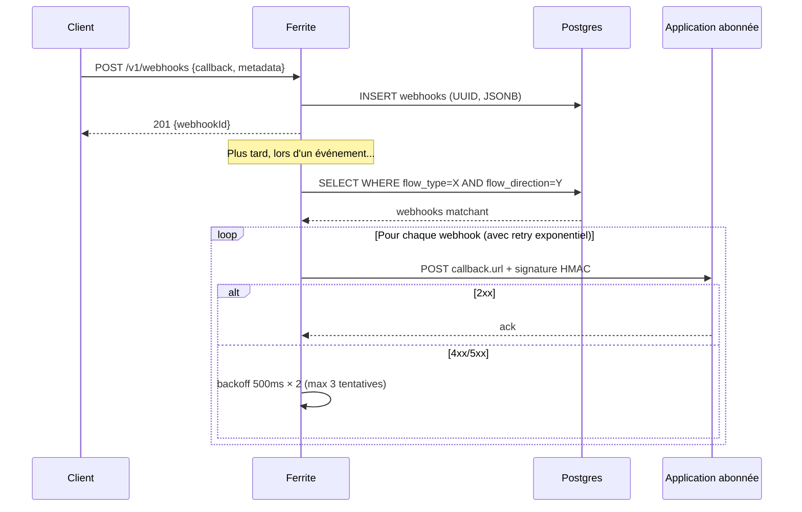
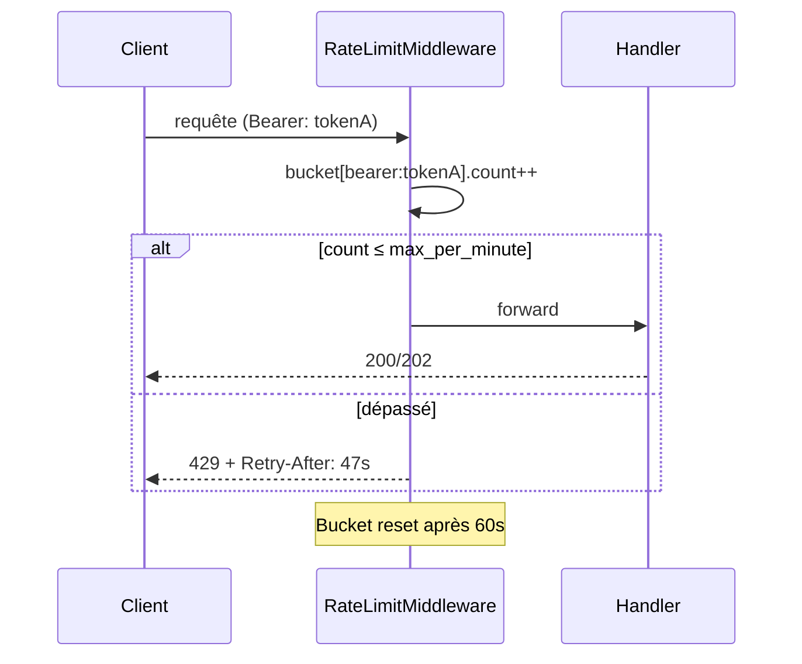
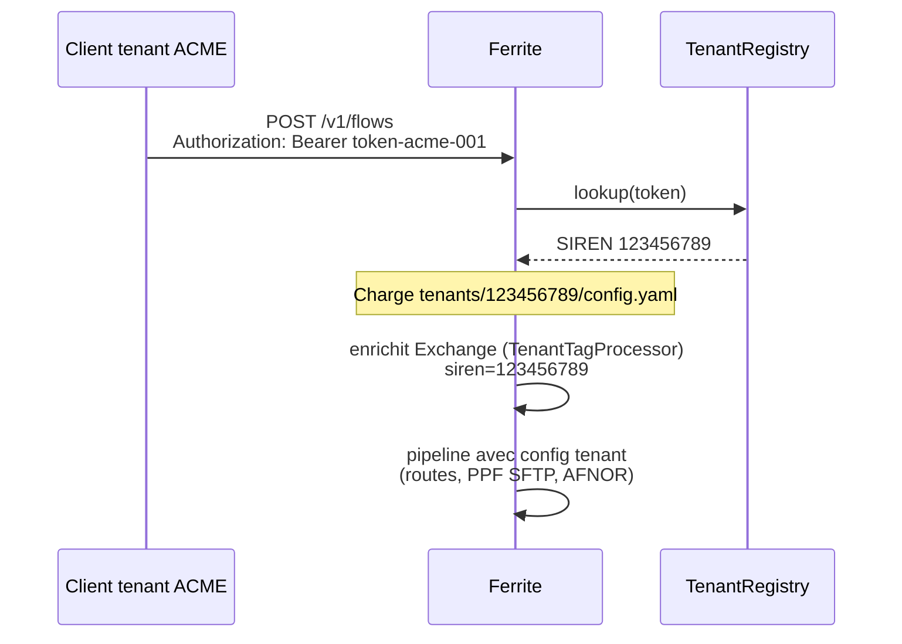

# API HTTP — Référence et exemples curl

Ferrite expose une API REST conforme **AFNOR XP Z12-013 V1.2.0** (Flow Service
+ Directory Service) plus quelques endpoints techniques (santé, métriques,
interface annuaire). Cette page liste tous les endpoints avec des exemples
curl pour tester en local.

## Démarrer le serveur

```bash
# 1. Adapter config.yaml (cf. installation.md). Section minimale :
#
# http_server:
#   host: "0.0.0.0"
#   port: 8080
#   bearer_tokens: ["test-token-123"]   # auth Bearer (omettre = mode dev sans auth)
#   max_flow_size_bytes: 104857600       # 100 MB (défaut)
#   request_timeout_secs: 30             # 408 au-delà
#   rate_limit_per_minute: 100           # 429 au-delà (omettre = désactivé)

# 2. Démarrer
cargo run --bin pdp -- start --config config.yaml --mode receiver

# Le serveur écoute sur http://localhost:8080
```

## Authentification

Tous les endpoints `/v1/*` (sauf `/v1/healthcheck`, `/metrics`, `/annuaire`,
`/v1/annuaire/search`) sont **protégés par Bearer token** :

```bash
export TOKEN="test-token-123"
curl -H "Authorization: Bearer $TOKEN" http://localhost:8080/v1/flows
```

Si `bearer_tokens` n'est pas configuré, l'authentification est désactivée
(mode dev).

## Codes HTTP gérés (XP Z12-013 §5.5)

| Code | Quand |
|------|-------|
| `200 OK` | Lecture réussie |
| `201 Created` | Création (webhook) |
| `202 Accepted` | Flux accepté pour traitement asynchrone |
| `204 No Content` | Mise à jour ou suppression réussie |
| `400 Bad Request` | Payload invalide, headers manquants, SHA-256 erroné |
| `401 Unauthorized` | Token manquant ou invalide |
| `404 Not Found` | Ressource inconnue (flowId, webhookId, SIREN) |
| `408 Request Timeout` | Requête dépassant `request_timeout_secs` |
| `413 Payload Too Large` | Flux > `max_flow_size_bytes` |
| `429 Too Many Requests` | Quota dépassé — `Retry-After` indique le délai |
| `500 Internal Server Error` | Erreur interne (consulter logs) |
| `501 Not Implemented` | Fonction non disponible (TraceStore absent, etc.) |
| `503 Service Unavailable` | Pipeline indisponible |

## Endpoints publics

### `GET /v1/healthcheck`
```bash
curl http://localhost:8080/v1/healthcheck
# → {"status":"ok","version":"...","pdp_name":"...","pdp_matricule":"..."}
```

### `GET /metrics` — Prometheus
```bash
curl http://localhost:8080/metrics
# pdp_flows_received_total ...
# pdp_flows_accepted_total ...
# pdp_flows_rejected_total ...
# pdp_webhooks_received_total ...
```

### `GET /annuaire` — UI HTML
Interface de recherche annuaire PPF (HTML, accessible navigateur).

### `GET /v1/annuaire/search?q=...` — JSON public
```bash
curl "http://localhost:8080/v1/annuaire/search?q=LUNATECH&limit=10"
```

## Flow Service (XP Z12-013 §5.1-5.3)

### `POST /v1/flows` — Dépôt de flux entrant (multipart)

Soumet une facture, un CDV ou un e-reporting. Réponse `202 Accepted` avec un
`flowId` AFNOR.

```bash
# Préparer flowInfo.json
cat > flowInfo.json <<'EOF'
{
  "trackingId": "TRACK-20260502-001",
  "name": "facture_001.xml",
  "flowType": "CustomerInvoice",
  "flowSyntax": "UBL",
  "flowProfile": "EN16931",
  "processingRule": "STANDARD",
  "sha256": "a1b2c3..."
}
EOF

# Déposer
curl -X POST http://localhost:8080/v1/flows \
  -H "Authorization: Bearer $TOKEN" \
  -H "Request-Id: req-12345" \
  -H "Organization-Id: 123456789" \
  -F "flowInfo=@flowInfo.json;type=application/json" \
  -F "file=@tests/fixtures/ubl/facture_ubl_001.xml;type=application/xml"

# → 202 Accepted
# {
#   "flowId": "...",
#   "submittedAt": "2026-05-02T10:00:00Z",
#   "trackingId": "TRACK-20260502-001",
#   "name": "facture_001.xml",
#   "flowType": "CustomerInvoice",
#   "flowSyntax": "UBL",
#   "flowProfile": "EN16931",
#   "processingRule": "STANDARD",
#   "status": "RECEIVED",
#   "message": "..."
# }
```

**Headers** :
- `Authorization: Bearer <token>` — obligatoire si auth activée
- `Request-Id` — corrélation logs (echo dans la réponse)
- `Organization-Id` — SIREN du tenant (multi-tenant)

**Erreurs** :
- `400` payload invalide / SHA mismatch / flowInfo manquant / file manquant
- `413` taille > `max_flow_size_bytes`
- `503` pipeline saturé

### `GET /v1/flows?status=...&from=...&to=...` — Liste

```bash
curl -H "Authorization: Bearer $TOKEN" \
  "http://localhost:8080/v1/flows?status=error&from=2026-05-01&to=2026-05-02"
```

### `GET /v1/flows/{flowId}` — Détail

```bash
curl -H "Authorization: Bearer $TOKEN" \
  http://localhost:8080/v1/flows/abc-123-def
```

### `GET /v1/stats` — Statistiques agrégées

```bash
curl -H "Authorization: Bearer $TOKEN" \
  http://localhost:8080/v1/stats
# → {"totalExchanges":123,"totalErrors":4,"totalDistributed":119}
```

Retourne `501 Not Implemented` si `TraceStore` n'est pas configuré
(Elasticsearch).

## Webhooks (XP Z12-013 §5.4)

Voir [webhooks.md](webhooks.md) pour la documentation complète des
événements et payloads. Récap des endpoints :

```bash
# CRÉER un abonnement
curl -X POST http://localhost:8080/v1/webhooks \
  -H "Authorization: Bearer $TOKEN" \
  -H "Content-Type: application/json" \
  -d '{
    "callback": {
      "url": "https://my-app.example.com/hook"
    },
    "metadata": {
      "flowType": "CustomerInvoice",
      "flowDirection": "In"
    }
  }'
# → 201 {"webhookId": "550e..."}

# LISTER
curl -H "Authorization: Bearer $TOKEN" http://localhost:8080/v1/webhooks
# → {"webhookIds": [...]}

# DÉTAIL
curl -H "Authorization: Bearer $TOKEN" \
  http://localhost:8080/v1/webhooks/550e...

# MISE À JOUR (PATCH partiel)
curl -X PATCH http://localhost:8080/v1/webhooks/550e... \
  -H "Authorization: Bearer $TOKEN" \
  -H "Content-Type: application/json" \
  -d '{"headers": [{"headerName": "X-API-Key", "headerValue": "..."}]}'
# → 204 No Content

# SUPPRIMER
curl -X DELETE http://localhost:8080/v1/webhooks/550e... \
  -H "Authorization: Bearer $TOKEN"
# → 204 No Content
```

### `POST /v1/webhooks/callback` — Réception PPF

Endpoint où le PPF pousse les CDV entrants. Vérification HMAC-SHA256
si `webhook_secret` est configuré.

## Directory Service (XP Z12-013 Annexe B)

Recherche et résolution dans l'annuaire PPF (nécessite PostgreSQL +
ingestion préalable du F14 — voir [annuaire.md](annuaire.md)).

### SIREN

```bash
# Détail SIREN
curl -H "Authorization: Bearer $TOKEN" \
  http://localhost:8080/v1/siren/code-insee:123456789

# Recherche SIREN (multi-critères)
curl -X POST http://localhost:8080/v1/siren/search \
  -H "Authorization: Bearer $TOKEN" \
  -H "Content-Type: application/json" \
  -d '{"name": "LUNATECH"}'
```

### SIRET

```bash
curl -H "Authorization: Bearer $TOKEN" \
  http://localhost:8080/v1/siret/code-insee:12345678901234

curl -X POST http://localhost:8080/v1/siret/search \
  -H "Authorization: Bearer $TOKEN" \
  -H "Content-Type: application/json" \
  -d '{"siren": "123456789"}'
```

### Codes de routage

```bash
# Recherche
curl -X POST http://localhost:8080/v1/routing-code/search \
  -H "Authorization: Bearer $TOKEN" \
  -H "Content-Type: application/json" \
  -d '{"siret": "12345678901234"}'

# Code spécifique
curl -H "Authorization: Bearer $TOKEN" \
  "http://localhost:8080/v1/routing-code/siret:12345678901234/code:0224ABC"
```

### Lignes annuaire

```bash
curl -H "Authorization: Bearer $TOKEN" \
  http://localhost:8080/v1/directory-line/code:ABC-123

curl -X POST http://localhost:8080/v1/directory-line/search \
  -H "Authorization: Bearer $TOKEN" \
  -H "Content-Type: application/json" \
  -d '{"siren": "123456789"}'
```

### Endpoints internes annuaire

```bash
# Stats globales
curl -H "Authorization: Bearer $TOKEN" \
  http://localhost:8080/v1/annuaire/stats

# Liste des PDP (plateformes)
curl -H "Authorization: Bearer $TOKEN" \
  http://localhost:8080/v1/annuaire/plateformes
```

## Tester les codes d'erreur HTTP

### 401 Unauthorized
```bash
curl -i http://localhost:8080/v1/flows         # sans token
curl -i -H "Authorization: Bearer wrong" \
  http://localhost:8080/v1/flows               # mauvais token
```

### 404 Not Found
```bash
curl -i -H "Authorization: Bearer $TOKEN" \
  http://localhost:8080/v1/flows/inexistant
```

### 413 Payload Too Large
```bash
# Configurer max_flow_size_bytes: 1024 dans config.yaml puis :
dd if=/dev/urandom of=big.xml bs=1k count=10
curl -i -X POST http://localhost:8080/v1/flows \
  -H "Authorization: Bearer $TOKEN" \
  -F "flowInfo=@flowInfo.json" \
  -F "file=@big.xml"
# → HTTP/1.1 413 Payload Too Large
```

### 408 Request Timeout
```bash
# Configurer request_timeout_secs: 1 puis envoyer un gros flux qui prend
# du temps à traiter
```

### 429 Too Many Requests
```bash
# Configurer rate_limit_per_minute: 5 puis :
for i in {1..10}; do
  curl -i -H "Authorization: Bearer $TOKEN" \
    http://localhost:8080/v1/webhooks
done
# → la 6e requête retourne 429 avec header Retry-After
```

## Workflow complet de test (5 minutes)

```bash
# 1. Démarrer
cargo run --bin pdp -- start --config config.yaml --mode receiver &

# 2. Healthcheck
curl http://localhost:8080/v1/healthcheck

# 3. Préparer flowInfo
SHA=$(shasum -a 256 tests/fixtures/ubl/facture_ubl_001.xml | cut -d' ' -f1)
cat > /tmp/flowInfo.json <<EOF
{
  "trackingId": "TEST-001",
  "name": "facture_test.xml",
  "flowType": "CustomerInvoice",
  "flowSyntax": "UBL",
  "sha256": "$SHA"
}
EOF

# 4. Déposer
curl -X POST http://localhost:8080/v1/flows \
  -H "Authorization: Bearer test-token-123" \
  -F "flowInfo=@/tmp/flowInfo.json;type=application/json" \
  -F "file=@tests/fixtures/ubl/facture_ubl_001.xml;type=application/xml"

# 5. Créer un webhook
curl -X POST http://localhost:8080/v1/webhooks \
  -H "Authorization: Bearer test-token-123" \
  -H "Content-Type: application/json" \
  -d '{
    "callback": {"url": "https://webhook.site/xxx"},
    "metadata": {"flowType": "CustomerInvoice", "flowDirection": "In"}
  }'

# 6. Métriques
curl http://localhost:8080/metrics | grep pdp_flows
```

## CLI alternative (sans HTTP)

Pour un test rapide sans serveur HTTP :

```bash
# Parser
cargo run --bin pdp -- parse tests/fixtures/ubl/facture_ubl_001.xml

# Valider
cargo run --bin pdp -- validate tests/fixtures/ubl/facture_ubl_001.xml

# Transformer UBL ↔ CII
cargo run --bin pdp -- transform tests/fixtures/ubl/facture_ubl_001.xml \
  --to CII -o /tmp/converted.xml

# Exécuter une route configurée
cargo run --bin pdp -- run-route route-ubl-reception
```

## Diagrammes de séquence

### Émission d'une facture (PA-E)



### Réception d'un flux (PA-R)



### Cycle abonnement webhook



### Erreur 429 (rate limit)



## Observabilité

### Corrélation Request-Id

Chaque requête peut porter un header `Request-Id`. Ferrite l'**echo** dans
la réponse et l'ajoute aux logs structurés du pipeline :

```bash
curl -i -X POST http://localhost:8080/v1/flows \
  -H "Authorization: Bearer $TOKEN" \
  -H "Request-Id: req-abc-123" \
  -F "flowInfo=@flowInfo.json" \
  -F "file=@facture.xml"
# Réponse contient :
#   Request-Id: req-abc-123
```

Côté logs JSON (`tracing_subscriber` avec format `json`) :
```json
{"timestamp":"2026-05-02T10:00:00Z","level":"INFO","fields":{"request_id":"req-abc-123","tracking_id":"TRACK-001","flow_id":"...","message":"Flux accepté"}}
```

### Traces Elasticsearch (pdp-trace)

Si `elasticsearch.url` est configuré, chaque transition de l'`Exchange` est
indexée dans `pdp-traces-{SIREN}` :

| Champ | Description |
|-------|-------------|
| `flow_id` | UUID Ferrite |
| `tracking_id` | ID externe fourni par le client |
| `siren` | Tenant (multi-tenant) |
| `status` | `received`, `validated`, `distributed`, `error`, ... |
| `processor` | Nom du processor (`AnnuaireValidationProcessor`, etc.) |
| `errors` | Tableau d'erreurs avec `step` + `message` |
| `timestamp` | RFC3339 |

### Queries Kibana utiles

```
# Toutes les erreurs d'un tenant sur 24h
status:error AND siren:"123456789" AND @timestamp:[now-24h TO now]

# Suivi d'un flux par tracking_id
tracking_id:"TRACK-20260502-001"

# Rejets pour vendeur inconnu (G1.63)
errors.step:"annuaire-validation" AND errors.message:*"Émetteur inconnu"*

# Volume horaire par type de flux
GET pdp-traces-*/_search
{
  "aggs": {
    "by_type": { "terms": { "field": "flow_type" } },
    "hourly":  { "date_histogram": { "field": "@timestamp", "fixed_interval": "1h" } }
  }
}
```

### Métriques Prometheus

| Métrique | Description |
|----------|-------------|
| `pdp_flows_received_total` | Compteur global de flux reçus |
| `pdp_flows_accepted_total` | Acceptés par le pipeline |
| `pdp_flows_rejected_total` | Rejetés (validation, SHA, taille) |
| `pdp_webhooks_received_total` | Webhooks reçus (PPF) |

```bash
curl -s http://localhost:8080/metrics | grep pdp_
# pdp_flows_received_total 1234
# pdp_flows_accepted_total 1198
# pdp_flows_rejected_total 36
# pdp_webhooks_received_total 87
```

## Multi-tenant

Ferrite supporte un mode multi-tenant où chaque entreprise a son propre
SIREN, sa config, sa séquence PPF et ses certificats.

### Activation

```yaml
# config.yaml racine
tenants_dir: tenants

# Mapping Bearer → SIREN (résolution HTTP)
token_tenant_map:
  "token-acme-001": "123456789"
  "token-megacorp-001": "987654321"
```

### Arborescence

```
tenants/
  123456789/
    config.yaml      # identité, routes, ppf, afnor
    sequence.txt     # compteur séquence PPF (persisté)
    certs/           # certificats SFTP/TLS (optionnel)
  987654321/
    config.yaml
    sequence.txt
```

### Résolution d'un appel HTTP



### Header `Organization-Id` (XP Z12-013)

Alternative au token : passer le SIREN explicitement (utile pour la
**délégation** où une PDP appelle pour le compte d'un client) :

```bash
curl -X POST http://localhost:8080/v1/flows \
  -H "Authorization: Bearer pdp-master-token" \
  -H "Organization-Id: 123456789" \
  -F "flowInfo=@flowInfo.json" \
  -F "file=@facture.xml"
```

Le `Organization-Id` est echo dans les logs et propagé jusqu'à l'`Exchange`
(propriété `tenant.siren`).

### Isolation des données

| Ressource | Isolation |
|-----------|-----------|
| Index Elasticsearch | `pdp-traces-{SIREN}` (un par tenant) |
| Webhooks (Postgres) | colonne `owner` filtre les listings |
| Séquence PPF | `tenants/{SIREN}/sequence.txt` |
| Certificats SFTP | `tenants/{SIREN}/certs/` |
| Logs | champ `siren` dans toutes les entrées JSON |

## Conformité AFNOR XP Z12-013

Pour chaque endpoint, mapping vers la spécification source.

### Annexe A — Flow Service V1.2.0

| Endpoint Ferrite | Op AFNOR | Section | Notes |
|------------------|----------|---------|-------|
| `POST /v1/flows` | `POST /flows` | §5.1 | Multipart `flowInfo` + `file`. Réponse `202` avec `FullFlowInfo` (flowId, submittedAt) |
| `GET /v1/flows/{id}` | `GET /flows/{flowId}` | §5.1 | `docType` query param non implémenté (extension Ferrite : retourne le `Flow` indexé ES) |
| `GET /v1/flows` | `POST /flows/search` | §5.2 | **Différence** : Ferrite expose `GET` au lieu de `POST` (filtres en query string) |
| `POST /v1/webhooks` | `POST /webhooks` | §5.4 | Conforme |
| `GET /v1/webhooks` | `GET /webhooks` | §5.4 | Retourne `webhookIds[]` (UIDs) |
| `GET /v1/webhooks/{id}` | `GET /webhooks/{webhookUid}` | §5.4 | Conforme |
| `PATCH /v1/webhooks/{id}` | `PATCH /webhooks/{webhookUid}` | §5.4 | Conforme |
| `DELETE /v1/webhooks/{id}` | `DELETE /webhooks/{webhookUid}` | §5.4 | Conforme |
| `GET /v1/healthcheck` | `GET /healthcheck` | §5.5 | Conforme |

### Annexe B — Directory Service V1.2.0

| Endpoint Ferrite | Op AFNOR | Notes |
|------------------|----------|-------|
| `GET /v1/siren/code-insee:{siren}` | `GET /siren/code-insee:{siren}` | Conforme |
| `POST /v1/siren/search` | `POST /siren/search` | Conforme |
| `GET /v1/siret/code-insee:{siret}` | `GET /siret/code-insee:{siret}` | Conforme |
| `POST /v1/siret/search` | `POST /siret/search` | Conforme |
| `GET /v1/routing-code/siret:{siret}/code:{id}` | `GET /routing-code/siret:{siret}/code:{routing-identifier}` | Conforme |
| `POST /v1/routing-code/search` | `POST /routing-code/search` | Conforme |
| `GET /v1/directory-line/code:{id}` | `GET /directory-line/code:{addressing-identifier}` | Conforme |
| `POST /v1/directory-line/search` | `POST /directory-line/search` | Conforme |

### Codes HTTP §5.5

| Code | Spec AFNOR | Implémentation Ferrite |
|------|-----------|------------------------|
| 200 | ✅ | Lecture Directory + Webhooks |
| 201 | ✅ | POST /webhooks |
| 202 | ✅ | POST /flows (asynchrone) |
| 204 | ✅ | PATCH/DELETE /webhooks |
| 400 | ✅ | Payload invalide, SHA mismatch |
| 401 | ✅ | Bearer manquant/invalide, OAUTH2 expiré |
| 404 | ✅ | flowId/webhookId/SIREN inconnu |
| 408 | ✅ | `request_timeout_secs` dépassé |
| 413 | ✅ | `max_flow_size_bytes` dépassé |
| 429 | ✅ | `rate_limit_per_minute` dépassé + `Retry-After` |
| 500 | ✅ | Erreur interne (consulter logs) |
| 501 | ✅ | TraceStore/Annuaire absent |
| 503 | ✅ | Pipeline mpsc saturé |

### Sécurité §5.6

| Mécanisme | Statut |
|-----------|--------|
| Bearer token (`Authorization: Bearer`) | ✅ |
| OAUTH2 client_credentials (callback webhook) | ✅ |
| HMAC SHA-256 sur les webhooks (algo `HS256`) | ✅ |
| TLS (configurable via `tls_cert_path`/`tls_key_path`) | ✅ |
| Délégation via `Organization-Id` | ✅ |

### Différences connues vs spec

1. **`GET /v1/flows`** : Ferrite propose `GET` avec filtres query string (au lieu de `POST /flows/search` du spec). Plus pratique pour les outils de debug. Le `POST /flows/search` peut être ajouté en complément si besoin de filtres complexes.
2. **`POST /v1/webhooks/callback`** : extension Ferrite pour la réception des webhooks PPF (hors scope AFNOR PDP↔PDP).
3. **`/v1/annuaire/stats`, `/v1/annuaire/plateformes`, `/annuaire`** : endpoints internes Ferrite (UI HTML + diagnostics), hors AFNOR.
4. **`/metrics`** : Prometheus (extension d'observabilité).

## Voir aussi

- [openapi.yaml](openapi.yaml) — Spec OpenAPI 3.1 (importable Swagger UI / codegen)
- [bruno-collection/](bruno-collection/) — Collection Bruno (testable depuis l'UI ou CLI)
- [tests.md](tests.md) — Tests automatisés (1052 tests workspace)
- [webhooks.md](webhooks.md) — Détail des événements et payloads webhook
- [annuaire.md](annuaire.md) — Ingestion F14 et schéma annuaire
- [installation.md](installation.md) — Build, config, prérequis
- [tracabilite.md](tracabilite.md) — Architecture Elasticsearch + index par SIREN
